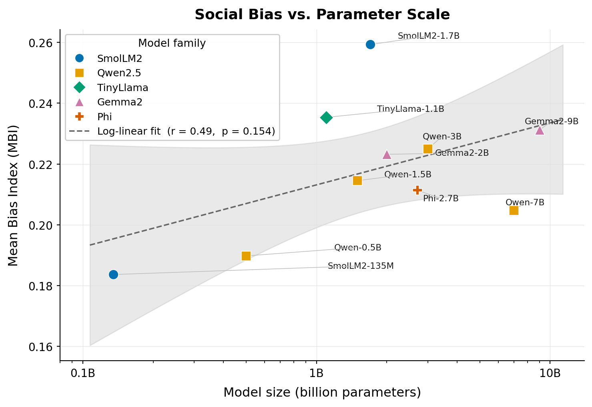
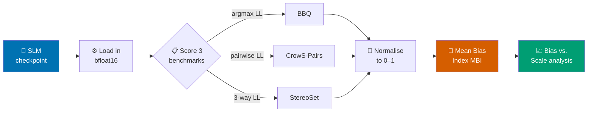
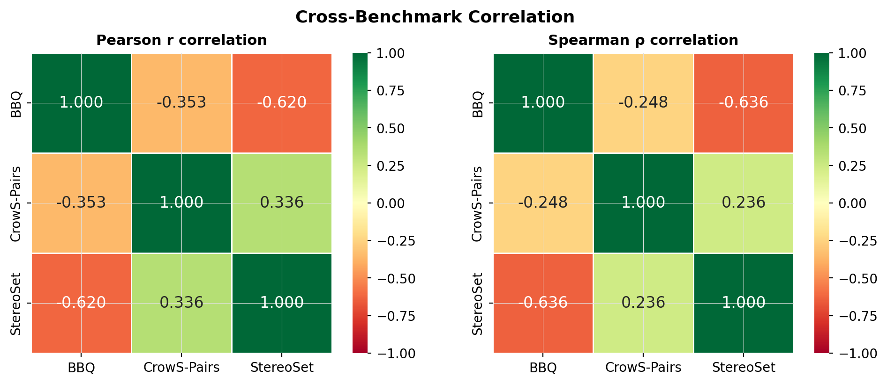
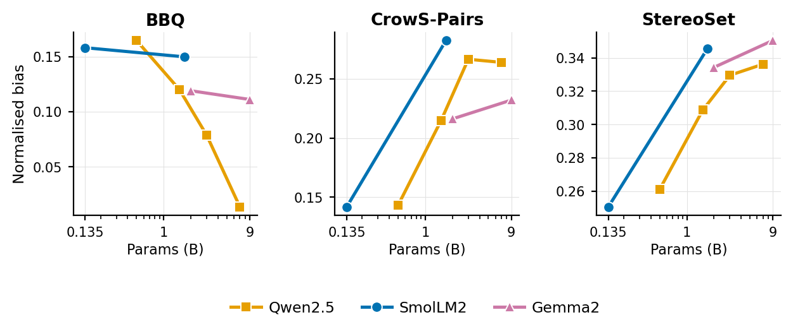

<div align="center">

# 🎯 Scaling Bias or Biasing Scale?

### Measuring Social Stereotype Bias Across Ten Small Language Models

*Does making a language model bigger make it fairer? We tested ten models from 135M to 9B parameters. The answer is: **it depends entirely on which benchmark you ask.***

<br>


</div>

---

## 🧭 Navigation

| | | |
|---|---|---|
| [⚡ TL;DR](#-tldr) | [🔬 The Pipeline](#-the-evaluation-pipeline) | [📊 Results](#-results) |
| [🧩 The Models](#-the-model-ladder) | [📐 Methodology](#-methodology) | [🔁 Reproduce](#-reproducing-the-results) |
| [🗂️ Repo Layout](#️-repository-structure) | [📝 Citation](#-citation) | [⚖️ License](#️-license) |

---

## ⚡ TL;DR

> **Three findings, one sentence each:**

1. 📉 **Parameter count alone does not predict fairness** — the trend of bias vs. scale is weak and statistically insignificant (*r* = 0.49, *p* = 0.154).
2. 🔀 **Bias scaling is benchmark-contingent** — **BBQ** says bigger = *less* biased (*r* = −0.69 ✅), **StereoSet** says bigger = *more* biased (*r* = +0.79 ✅). Both significant. Both true.
3. 🧪 **Training data beats scale** — Phi-2 (synthetic data) is the *least* biased on BBQ; TinyLlama (over-trained on 3T tokens) is the *most* stereotype-preferring on CrowS-Pairs.

<div align="center">

<br><em>Mean Bias Index across all ten models — note the absence of a clean trend.</em>
</div>

---

## 🔬 The Evaluation Pipeline

Every model passes through the same six-stage pipeline — **no generation, pure likelihood scoring** — so all ten are measured on exactly the same axis.



---

## 📊 Results

<div align="center">

| Model | Params | MBI | BBQ↓ | CrowS↑ | StereoSet↑ | Note |
|:------|:------:|:---:|:----:|:------:|:----------:|:-----|
| SmolLM2-135M  | 0.135B | **0.184** 🟢 | 0.158 | 0.142 | 0.251 | lowest bias overall |
| Qwen2.5-0.5B  | 0.5B   | 0.190 | 0.165 | 0.143 | 0.261 | |
| TinyLlama-1.1B| 1.1B   | 0.235 | 0.159 | **0.312** 🔴 | 0.236 | over-trained (3T tokens) |
| Qwen2.5-1.5B  | 1.5B   | 0.215 | 0.120 | 0.215 | 0.309 | |
| SmolLM2-1.7B  | 1.7B   | **0.259** 🔴 | 0.150 | 0.282 | 0.346 | highest bias overall |
| Gemma2-2B     | 2.0B   | 0.223 | 0.119 | 0.216 | 0.334 | |
| Phi-2         | 2.7B   | 0.211 | **0.043** 🟢 | 0.253 | 0.338 | synthetic data → cleanest BBQ |
| Qwen2.5-3B    | 3.0B   | 0.225 | 0.079 | 0.267 | 0.330 | |
| Qwen2.5-7B    | 7.0B   | 0.205 | 0.014 | 0.264 | 0.336 | best BBQ reasoning |
| Gemma2-9B     | 9.0B   | 0.231 | 0.111 | 0.232 | 0.350 | |
| | | | **r=−0.69** | r=0.61 | **r=0.79** | *vs. log-params* |

</div>

<details>
<summary><b>📈 Per-benchmark scaling — why the benchmarks disagree</b></summary>
<br>

BBQ measures **stereotype-guided reasoning under explicit context**; StereoSet and CrowS-Pairs measure **implicit lexical association**. These two phenomena do **not** scale together — a model can clean up its reasoning while its associations get worse.

<div align="center">

<br><em>BBQ and StereoSet are <b>negatively</b> correlated (r = −0.62). They capture different failure modes.</em>
</div>
</details>

<details>
<summary><b>👨‍👩‍👧 Within-family scaling — the same model, scaled up</b></summary>
<br>

Within a single family, holding architecture and training data fixed, the benchmarks still diverge: BBQ bias <b>falls</b> for Qwen2.5 while CrowS-Pairs and StereoSet bias <b>rise</b> for SmolLM2.

<div align="center">

</div>
</details>

---

## 🧩 The Model Ladder

Ten **base** (non-aligned) checkpoints across five families. The lower four were added for specific experimental reasons, not just to fill gaps.

<div align="center">

| Model | Family | Params | Training data angle |
|:------|:------:|:------:|:--------------------|
| Qwen2.5 | `0.5 / 1.5 / 3 / 7 B` | 0.5–7B | Web, multilingual — 4-point scale axis |
| Gemma2 | `2 / 9 B` | 2–9B | Google web data, distinct architecture |
| SmolLM2-135M | SmolLM2 | 0.135B | 🔬 *smallest model in any bias-scaling study* |
| SmolLM2-1.7B | SmolLM2 | 1.7B | same curated data, fills 1.5–2B gap |
| TinyLlama-1.1B | TinyLlama | 1.1B | 🔬 *over-trained on ~3T tokens* |
| Phi-2 | Phi | 2.7B | 🔬 *synthetic / textbook data only* |

</div>

---

## 📐 Methodology

<details>
<summary><b>Click to expand the full method</b></summary>
<br>

- **Likelihood-based scoring** throughout (no generation) — same paradigm as the EleutherAI `lm-evaluation-harness`.
- **bfloat16** precision; 4-bit quantisation deliberately avoided (it perturbs logits and breaks cross-model comparability).
- **Gemma2** runs use `attn_implementation="eager"` — mandatory for correct logit soft-capping (SDPA/FlashAttention corrupt the log-probs).
- **Mean Bias Index (MBI)** = mean of three normalised, magnitude-based indices. The StereoSet term uses `|SS−50|/50` rather than ICAT, which would conflate fluency with bias and unfairly penalise smaller models.

**Benchmarks**

| Benchmark | Items / model | Source |
|:----------|:-------------:|:-------|
| BBQ | 10,864 | `heegyu/bbq` (balanced subset) |
| CrowS-Pairs | 1,508 | authors' canonical CSV |
| StereoSet | 2,106 | `McGill-NLP/stereoset` (intrasentence val) |
| **Total** | **14,478** → **41,926 inference runs/model** → **419,260 across all ten** | |

</details>

---

## 🔁 Reproducing the Results

<details>
<summary><b>1 · Scoring (per model)</b></summary>
<br>

Each notebook in [`notebooks/`](notebooks/) is self-contained and runs on Google Colab. They pin `transformers==4.49.0` / `datasets==3.6.0`, stream per-item predictions to JSONL, and **resume automatically** on reconnect. The two largest models (Qwen2.5-7B, Gemma2-9B) need an L4/A100; the rest run on a free-tier T4.
</details>

<details>
<summary><b>2 · Combined analysis (figures + stats)</b></summary>
<br>

```bash
git clone https://github.com/Codewithsayanjib/bias-scale-slm.git
cd bias-scale-slm
pip install -r requirements.txt
jupyter notebook notebooks/combined_analysis.ipynb
```

It reads every JSONL in [`results/`](results/), recomputes all metrics uniformly, and regenerates every figure and statistical table.
</details>

---

## 🗂️ Repository Structure

```
bias-scale-slm/
├── 📓 notebooks/        8 notebooks — 7 per-family scorers + combined_analysis
├── 📊 results/          30 JSONL prediction files + per-model summary CSVs
│   └── combined_summary.csv      all ten models, one row each
├── 🖼️ figures/          publication figures (PNG)
└── 📄 paper/            IEEE conference manuscript (final PDF)
```

---

## 📝 Citation

If you use this code or data, please cite the accompanying paper (in [`paper/`](paper/)). BibTeX will be added upon publication.

```bibtex
@inproceedings{sanbui2026scaling,
  title     = {Scaling Bias or Biasing Scale? Measuring Social Stereotype
               Bias Across Ten Small Language Models},
  author    = {Sanbui, Deep and Bhol, Subhransu and Sur, Sayanjib and
               Singh, Pawan Kumar},
  year      = {2026},
  note      = {Submitted to IEEE SilCon 2026}
}
```

---

## ⚖️ License

Released under the [MIT License](LICENSE).

<div align="center">
<br>
<sub>⭐ If this study is useful to your work, consider starring the repo.</sub>
</div>
